# Building Vectorization, Tree Mapping, and 3D City Model Visualization 

 
 'WHOOPWHOOP!'
 
This training will help you to generate 3d vectorized buildings and animations starting from calibrated/oriented images and a calibrated pointcloud.

## Requirement 

We will use TerraScan, TerraModeler and Terraphoto.
You need to have followed one of the basic trainings (ALS or MLS).

## Data set: Jyväskylä

Origin :
 * part of Jyväskylä city, laser data from 2011, images from 2012 
Included in the training folder :
 * laser data prepared (ground, building roofs classified)
 * class file
 * images from 5 cameras (vertical, oblique)
 * mission, adjusted image list , (true-)orthophotos 
 * dgn file

Overview of user interfaces :
  * main menu [TScan](http://www.terrasolid.com/guides/tphoto/mw.php), [TPhoto](http://www.terrasolid.com/guides/tscan/index.html?intromainwindowmenucommands.php)
  * main tool box [TScan](http://www.terrasolid.com/guides/tscan/intromaintoolbox.php)
  * general tool box [TPhoto](http://www.terrasolid.com/guides/tphoto/tboxgeneral.php), [TModeler](http://www.terrasolid.com/guides/tmodel/tbox_general.php), 

## Building vectorization (automatically/manual improvements) 

Our first big part consists in the building vectorization. Tscan offers tools to automatically generate buildings from the pointcloud. A complete toolbox also offer us a way to adjust/complete this product. 

### Preparation

#### Pointcloud analysis

We open the dgn file in the `<training>/dgn` folder with microstation so that we can start.
If it is not loaded yet, load Terrascan with microstation `key-in` : `mdl load tscan`

We open the project using the [main tool box](http://www.terrasolid.com/guides/tscan/intromaintoolbox.php) in `<training>/dgn` folder and then one of its blocks. 

 

We can now play around with the data, checking its density, classification and noise level.

cut overlap not done → would be better to do to reduce noise level and to avoid issues due to mismatch in data 
density with overlap ~23pts/m2, without overlap ~10pts/m2
10 pts/m2 are good for vectorizing buildings with major details on roofs, less density allows only vectorization of large buildings, more density improves result only marginally 

 ---
 _Note_ : 
 We can notice a first issue in the dataset. There is no point on dark roofs, vectorization will not be possible on them
 ---
 

The classification was done using the grouping tools. It isolates the roof details (as chimneys) in a different class.

 
We have now analyzed our data, you can close the block.

#### Images preparation

For this part we will use Terraphoto. 
Once Terraphoto is loaded (key-in : `mdl load tphoto`), we open the mission file `<Trainin>/mission/jyvaskyla_midas.mis`.
We then load a point cloud as a DTM. We could have extracted model key points from our ground class but was done for use, just use the file `<Trainin>/laser03/key15.fbi` (main window menu : [Points/Import from file](http://www.terrasolid.com/guides/tphoto/mwloadfromfile.php).  
 

  
Some parameters need to be checked in TerraPhoto settings:

 * [Memory usage > Image cache](http://www.terrasolid.com/guides/tphoto/setmemoryusage.php) set to `4000 MB` (64-bit version).
 

* [Builtin projection systems](http://www.terrasolid.com/guides/tphoto/setbuiltinprojectionsystems.php) with `Finnish ETRS GK26` on.

Now you can open the [image list](http://www.terrasolid.com/guides/tphoto/mwloadlist.php?) <training>/mission/image_hrp_adjusted.iml through the main window image menu.

##### Image inspection 📷

The image list is now loaded. We will be able to look at the 
, check their quality, their location and their orientation. 

To look at all the images, we use [Define color corrections](http://www.terrasolid.com/guides/tphoto/mwdefinecolorcorrections.php) available in the image's menu.

The last number in image number indicates camera, e.g. 1=vertical cam, 2=backward-looking oblique cam, etc. You can also use the select by Camera tool.

##### Image filtering

Now that we are sure that our images are well in place. We will extract the list of the vertical camera images. Indeed, our tool for automatic vectorization only use them. To do so, we [delete the other camera images](http://www.terrasolid.com/guides/tphoto/mwdeletebycamera.php)from the list and save the new list under a new name. The tool is in the image menu.
 

We save the image list in the mission subfolder as `images_hrp_adjusted_vertical.iml`.

### Macro : automatic vectorization

#### Macro inspection

Our building vectorization will be done through a macro. It has been already prepared but let's go through its parameters to understand how it works. Open the <macro>/vectorize_buildings.mac file through the Tscan main window tool/macro menu.
 

The function used is [vectorize buildinga](http://www.terrasolid.com/guides/tscan/mavectorizebuildings.php). Edit it to access its parameters.

* user roof class: forces the vectorization of smaller details on roof represented by points in this class, ignores minimum detail setting (put to `none`)

* low classes: helps to place edges, use ground only if images are available, use ground and low vegetation if no images are available (`class 2, ground` here) 

* footprints can be used, only buildings with footprints are vectorized (`Do not use`)

* planarity: how well points must fit to the plane equation describing a roof plane, ~15 cm for “normal” ALS data, normally not smaller than 10 cm (here `0.12m`)

* increase tolerance: close-to-horizontal planes should be modeled as one roof plane, requires increase in planarity tolerance (here `0.25m`

* use images if available,  ~ 90% vectorization is then done from laser points and around 10% from images. The downside is that it prevents us to use tslave to launch the macro. You might want to tick it off on bigger project.

* output file : here will be defined all the generated polygons, the #bnumber make it possible to run the macro on every blocks without any overwriting one output by the other, value : `<yourfolder>\buildings\build_#bnumber.txt`.

#### Macro launch 

As this is a training, we will only work on block 33 for the following steps. We select it in TScan Project window and use the [run macro on project](http://www.terrasolid.com/guides/tscan/marunonproject.php) tool, `selected blocks only`, `200m` of neighbours, `Do not save points`. We do not save the points because we are not changing them, only generating an output file. As we ticked the use of images, we can not run in TSlave.

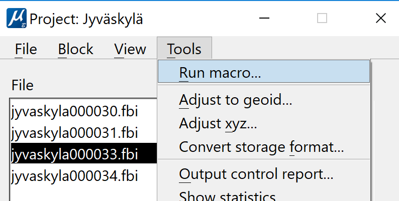

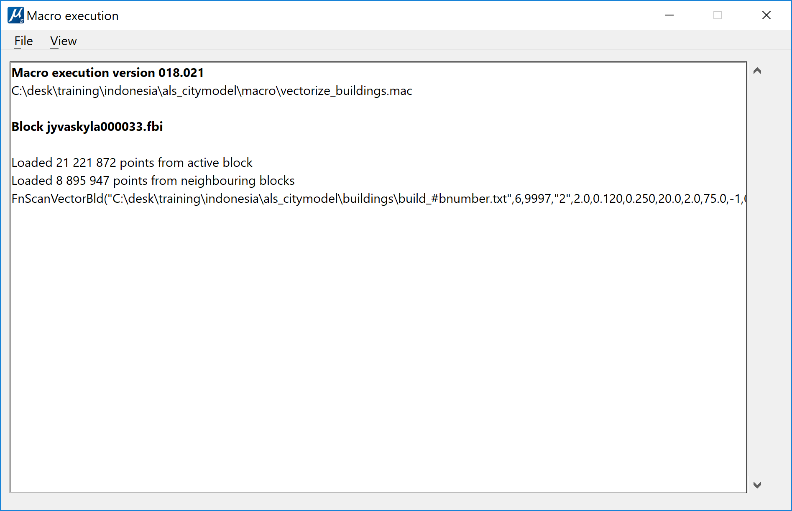

 #### Result analysis
 
 ##### Model loading

If you open the text file in a text editor, you will notice that only the geometries are available. No level, color or texture is associated with them. We will first associate some levels to different parts of our models when loading the vectors. To do so, we go to Tscan `settings/Building vectorization/levels`.

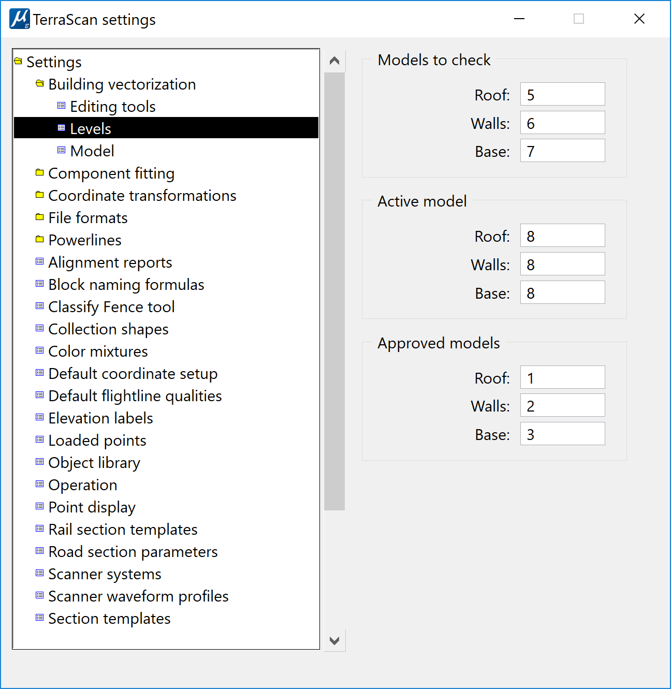

You should have roof, wall and base polygons specified on different levels.

As this setting is done, we can import the buildings. This is done through the [read/Building models](http://www.terrasolid.com/guides/tscan/mwreadbuildingmodels.php) tool in Terrascan main window.

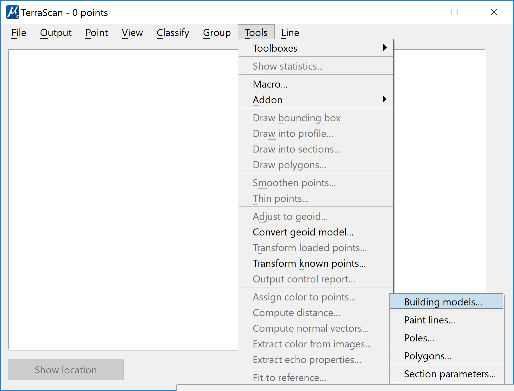

We will let the wall color to be picked at random.

Once the models are loaded, be sure to activate their levels and to use a smooth rendering to look at them 👍.

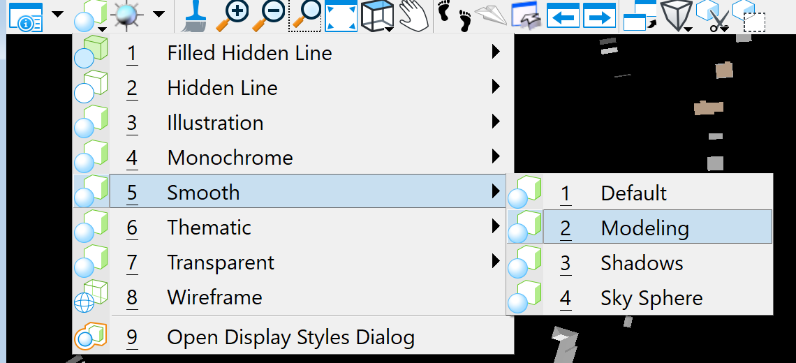

##### Model check/correction

You can have an overall look at the models to have an idea about how well it went and how many building are missing. Most of the errors should come from classification errors. After this, we will go through the models one by one using the [check building model tool](http://www.terrasolid.com/guides/tscan/toolcheckbuildingmodels.php) in the building toolbar.

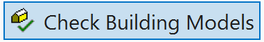

The parameters will be as followed :
* Show : `Unchecked buildings`, as we have yet to check any building, all building will be listed.
* Footprints : `None`, __important__ as it would mess our control if you put anything else here.
* Arrange views : `ticked`, it will allow a more efficient process, of course you can rearrange the views afterwards.
* Views :
    + View 1 → display of active (selected) model, wireframe rendering, rotated top view, good for understanding xy relationship of model, level with colored edges visible
    + View 5 → rotated view, smooth rendering, good for 3D understanding of model, only level with active model should be visible 
    + View 7 → perspective/camera view, raw image displayed with lens distortion applied, viewer = camera position, displays best image for showing whole building (“overview”) 
    + View 8 → another camera view, displays image that is best for placing an edge or corner of the model (“detail view”), updated when a building modification tool is used to select an edge or corner 

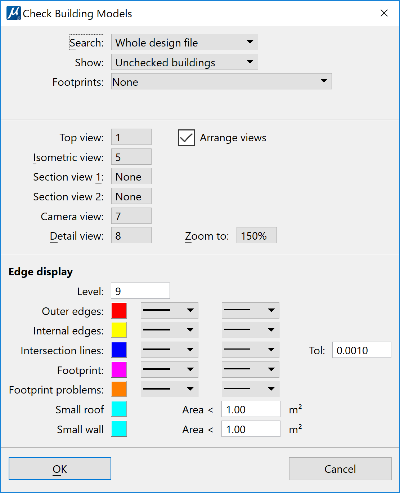

😊 The set up in place, we can start to check and correct our models! 

There is a bunch of tools to correct buildings, not all of them are easy to understand on your first use so pick a simple model and start with the simpliest tools. Of course you should go through all the tools documentation ( [Building patches](http://www.terrasolid.com/guides/tscan/tboxbuildingpatches.php) and [Building edges](http://www.terrasolid.com/guides/tscan/tboxbuildingedges.php) ) should you start a real life city modelling project.

 ---
 _Note_ : 
A [video](http://www.terrasolid.com/download/animations/deliverybpt.php) 🎬 displaying how to do it (__maybe include an iframe__) is available  on our website.
---

## Point cloud coloring, model and ground texturing 

The geometries of our vector models are now good (or should be 😅), let's add some realistic colors to our project!

### PointCloud coloring

#### Orthophotos as reference

To apply realistic coloring to our pointcloud, we will first need to attach orthophotos as references in TPhoto. This will be done through [Manage raster references](http://www.terrasolid.com/guides/tphoto/toolmanagerasterreferences.php) tool.

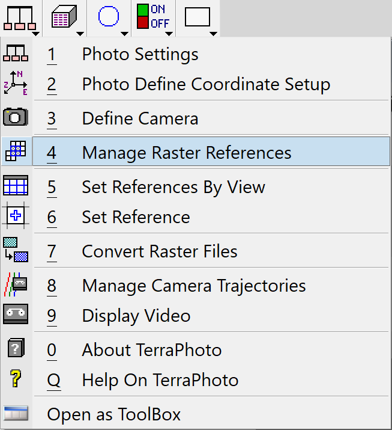

Here we go to `File/Attach directory` and we select the `ortho` subfolder. TerraPhoto dialog ask you now on which mode/views you want to display the references. Please pick `view 1` and `Render`.

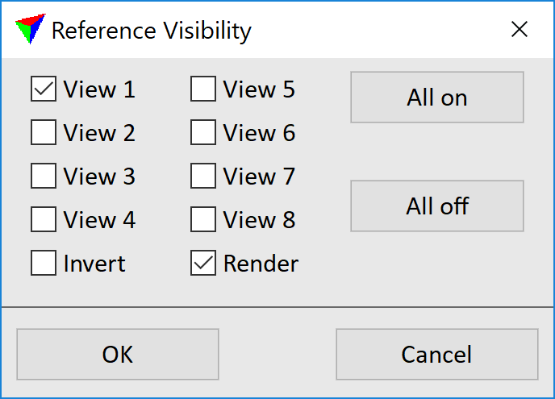

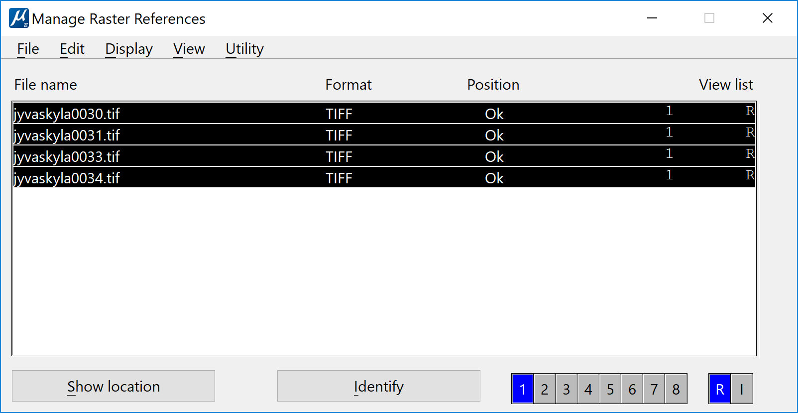

#### Extract color for points from orthophotos 

Once the references are available, we need to use them to color the pointcloud. This is done in a two steps process. 

* First you activate your `color` attribute in the Terrascan project ([Edit project information](http://www.terrasolid.com/guides/tscan/prjeditprojectinformation.php)). 

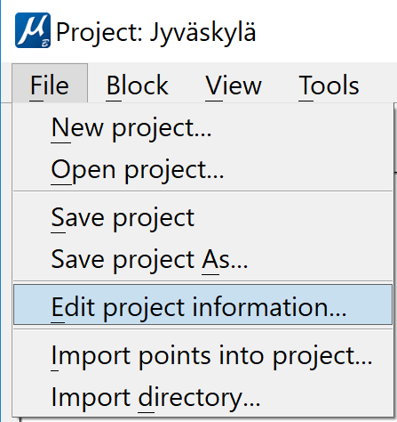

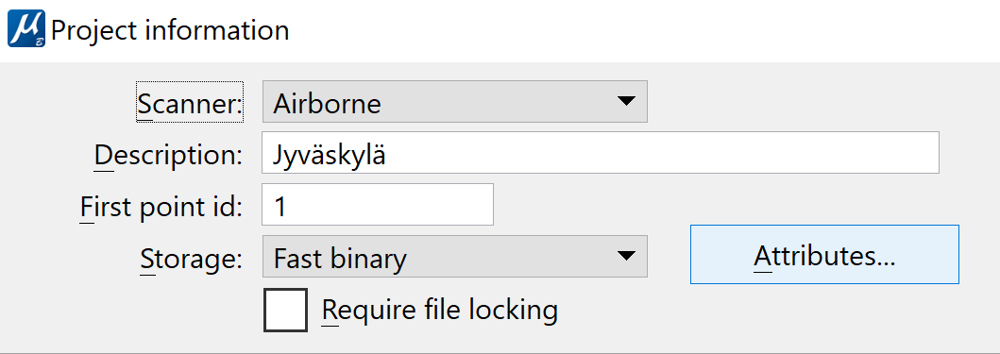

 ---
 _Warning_ : 
If you do not do this, the pointcloud in memory will be colored but not the saved one.
---

* For the second step you [extract color from images](http://www.terrasolid.com/guides/tscan/mwextractcolorfromimages.php), action which consists in applying the image colors to the points with the same XY coordinates.

Parameters will be :
 + all classes : we want to color all classes.
 + extract from ortho images : these should be the only images available.
 + footprint 1 pixel : we will use only the closest pixel to define our point color.

 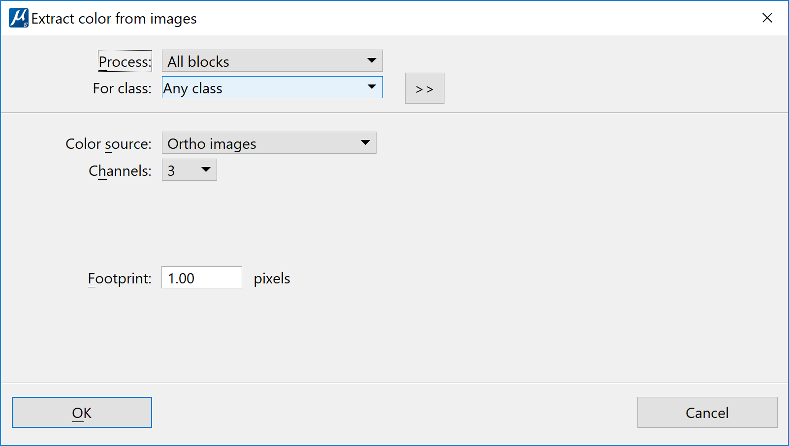

#### Vizualisation

To see the result of our work, let's switch off display of orthos for view 1 (keep R on for rendering) in the manage raster reference tool, load laser points from all files of the project and display points by color.

 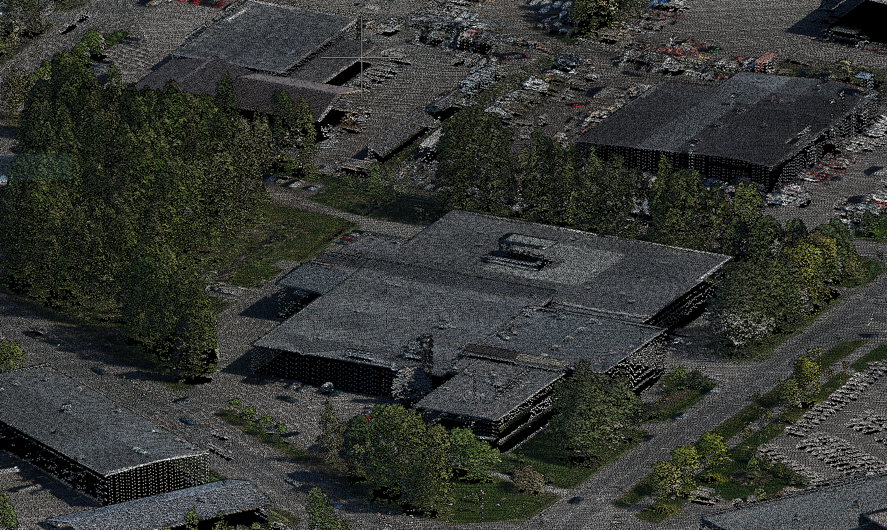

Good news, it worked! 😊

 ---
 _Trick_ : 
If your rending seems noisy, you can go to `Tscan Settings/PointDisplay/Depth separation` and change it to around `4.0m`. 
--- 

### Model texturing

#### Oblique image list

The model wall texturing will be done by applying the oblique images as texture to the building models. To do so, we need to load an oblique image list.

* Close the loaded image list (with only vertical images)
 
 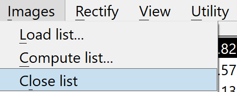

* Load the complete image list (`hrp_adjusted`) through the Images menu.
* Delete the vertical images through [delete the other camera images](http://www.terrasolid.com/guides/tphoto/mwdeletebycamera.php).

* Save the new list as `images_hrp_adjusted_oblique.iml `

#### Texturing

To texture our walls, we need to select our models. To do so, make all levels with vector models visible in dgn, all other levels invisible and use microstation selection tool. 

We can then go to TerraPhoto Rectify menu and select [Rectify wall rasters](http://www.terrasolid.com/guides/tphoto/mwrectifywallrasters.php?) with the following parameters :

* Images : `All images`
* Minimum area : `5 m2`
* Coverage : `10%`
* Pixel size : `0.10 m`
* Format : `Tiff`
* Depth maps : `do not use` 
* Raster directory (output) : `<project>/dgn`
* Prefix : wall_modify 
* Modify element color : `✅`

 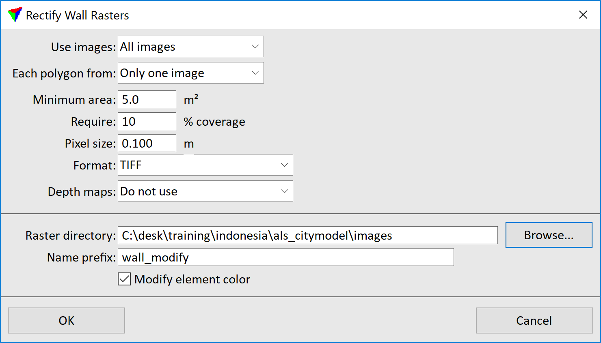

Thousands of images should now be created in your dgn folder. To see the result, we need to use Tphoto [Render view tool](http://www.terrasolid.com/guides/tphoto/tooldisplayrenderedview.php) on view one and maybe rotate it to an isometric point of view.

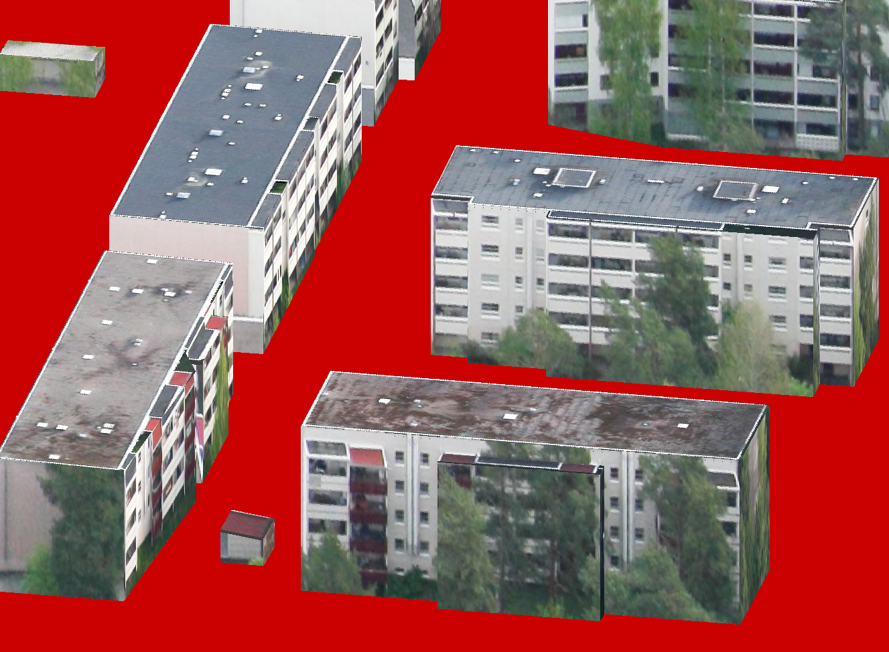

It worked! 🎉🎉

If your wall and/or your roof is not appearing as on the image above, you have to check the [Display Rendering Settings tool](http://www.terrasolid.com/guides/tphoto/tooldefinerenderingsettings.php). 

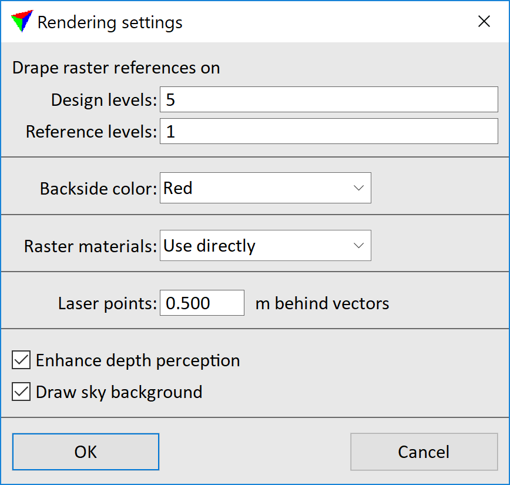

 ---
 _Warning_ : 
The Design levels parameter refers to the levels containing vectors rendered using the Manage Raster Reference tool we used to color the pointcloud. If you put the level 6 on the list, the wall texture will use the images from the ortho instead of the ones generated from the oblique images.
--- 

If you lost your raster references since the point cloud coloring, you can put them back following the same instruction ( Manage Raster Reference tool > Subfolder : `Ortho` View `R` (for rended) ticked.

Now lastly you select again the Render view tool, you pick view 1 and it should work (both roofs and walls rendered).

### Ground Rendering (TerraModeler)

#### Surface generation

As you can see, the ground is red on the image. We will use a Terramodeler tool to render it.

In TerraModeler Surfaces tool, go to File and pick [Import binary file](http://www.terrasolid.com/guides/tmodel/importxyzbinaryfile.php).

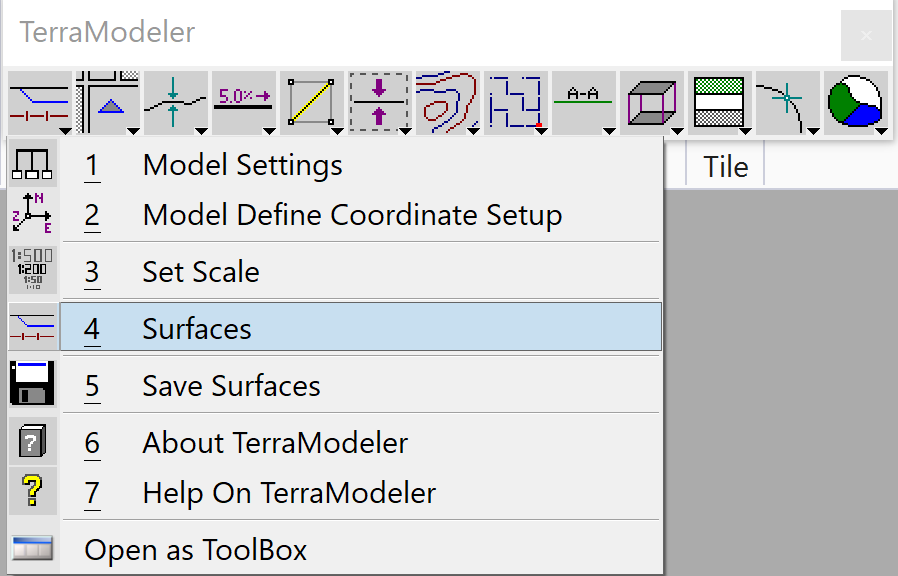

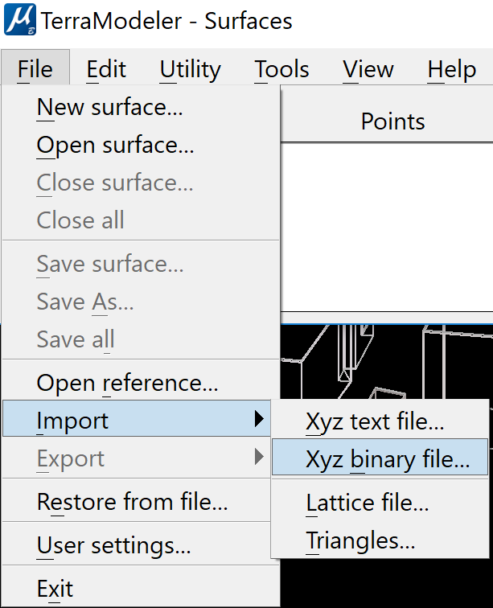

Then we pick `key15.fbi` file from laser folder

The next dialog ask us to specify if our point have a special meaning (are they to be used to compute breaklines by example). As our fbi file contains only "classic" meaningful ground point, we can let the setting as `Random point`.

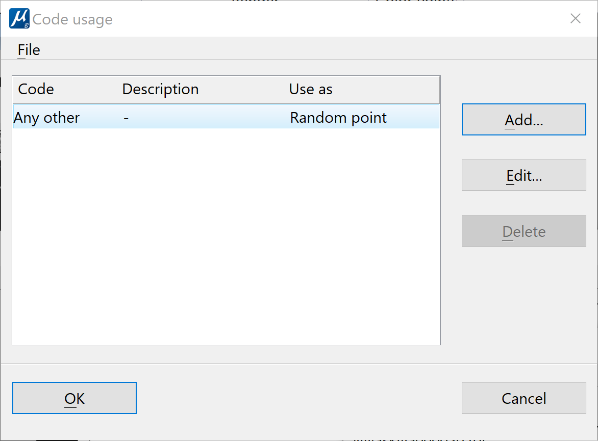

We have our points, we can now triangulate them through the [Triangulate surface dialog](http://www.terrasolid.com/guides/tmodel/triangulatesurvey.php). For this step, tick off all.

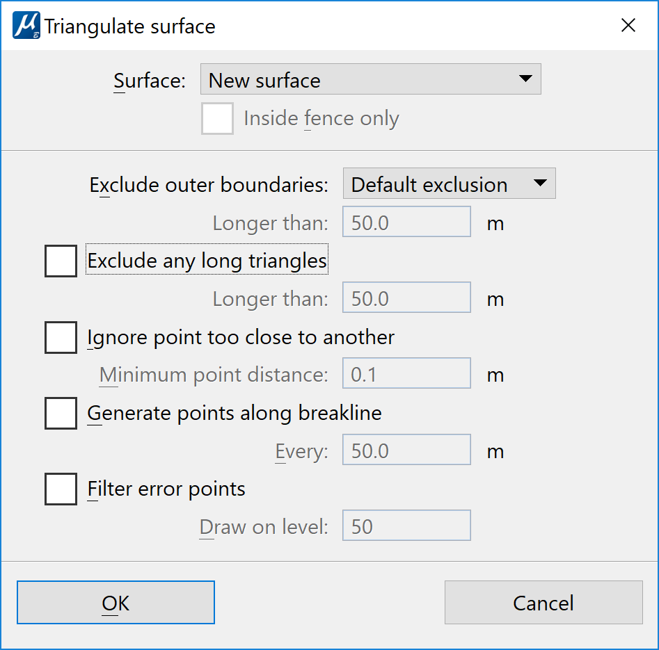

In the secondary Surface settings dialog, we name the surface model from our fbi file, `key15`.

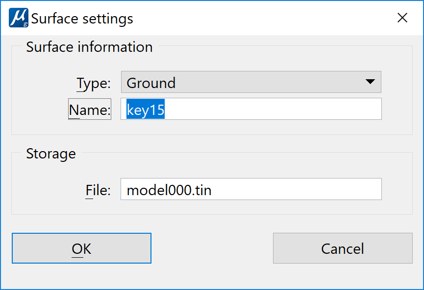

#### Surface rendering

To render the surface, we first need to vectorize its triangles in microstation. For this step, we use [Display raster triangles](http://www.terrasolid.com/guides/tmodel/displayrastertriangles.php?).

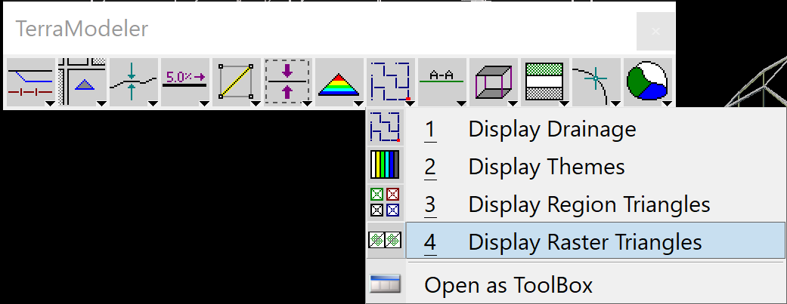

As parameters, we choose our `key15` surface and generate display the triangles on `level 55` on view `1`.

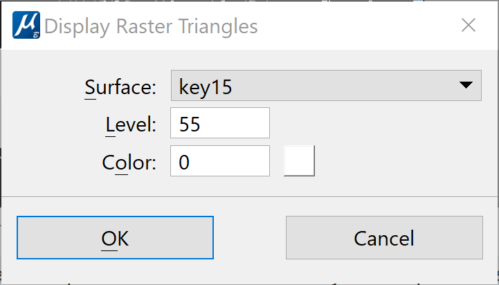

If your level 55 is active, white triangles should appear on view 1, if not, activate this level.

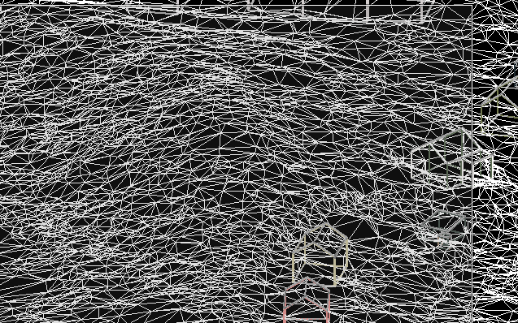

Now we render everything with with TPhoto Render view tool. Be careful to drape the orthos on surface model.

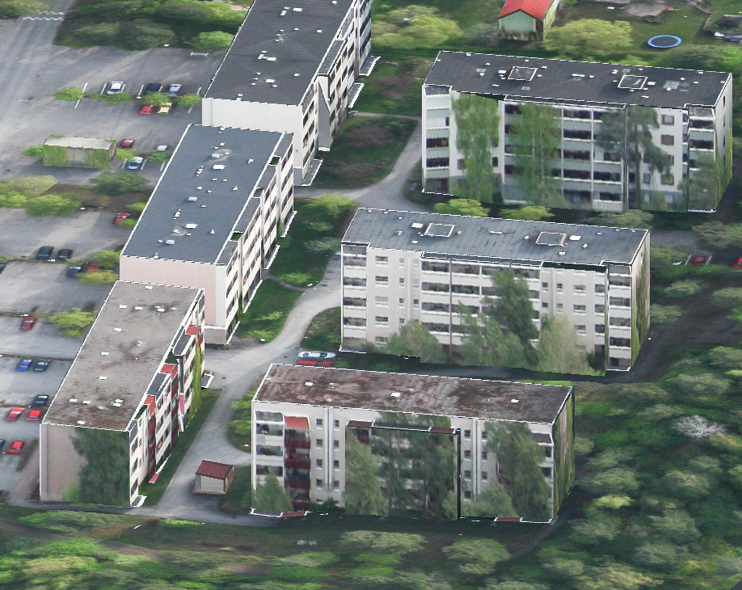

It all done : ground, roofs and walls are textured.
 
## Fly-through movie creation 

### Data preparation

As most our data is ready (point colored and vector elements rendered) we will prepare and produce our final animation. 

To complete our building models, we will use some of the point classes. Please open the `block 33`, go to the display tool of Terrascan and select only  medium, high vegetation and pole classes.

As you can see the tree shapes are really well represented through dense point clouds. Colors from images are not so good for smaller, especially linear objects. Constant or intensity colors offer better for visualization for these, constant color can highlight objects in point cloud. 

use TPhoto Render view tool, display rendered view with points on trees and poles 

 

open Display mode dialog, Color by intensity custom, Colors button 

save the intensity coloring scheme into a file 

cancel, close Display mode dialog 

 

assign intensity coloring to points in poles class 

Tools > Assign color, class poles, intensity coloring, select intensity color file 

use TPhoto Render view tool, display rendered view with points on trees and poles, check pole visualization 

 

save points 

Creation of a fly-through animation 

read all FBI files of the project, switch off time, line,... attributes, just keep attributes that are good for visualization (color, intensity) 

 

change active level to an empty level (e.g. 20) 

 

digitize a line string element that can serve as camera path for fly-over animation 

MS Place smart line tool, rounded corners 

use TModeler Set linear elevation tool and move line string to 300 m 

select element 

 

start Create fly-through movie tool in TPhoto 

back clipping 2500 m, front clipping 1 m 

render quality = High quality (for vector models and images draped on ground/roofs, lower quality for rendering only laser data, Capture if text needs to be included) 

video speed 25 frames/second, default speed = camera speed = 30-40 m/seconds for fly-overs 

change active level to empty level and color to other color 

Target > Create vectors 

to define the viewing direction of camera 

direction forward onto surface, step 50 m, distance 250 m, surface = key15, dz = 0 

open view 7, setup the view for recording frames of fly-over animation: 

view size (=frame size) 

view content (= frame content), e.g. level visibility (vector models, surface model triangles), point cloud display 

open TPhoto Define rendering settings > Enhance depth perception on, maybe sky background on 

check a few views with the preview option of the Create fly-through dialog, type frame number, click Preview, fix display if necessary 

create a few frames 

use e.g. Windows Movie Maker software to combine frames into a movie 
 
More information about this topic 

TScan Users Guide, Chapter 9: 3D Building Models http://www.terrasolid.com/download/user_guides.php) 

Training animations: http://www.terrasolid.com/download/animations/deliverybpt.php 

Tree mapping for cities 

check cell library, attach ″karttali″ from terra installation folder 

check settings for tree species in TScan 

sample species birch and spruce 

use cells from the sample library 

draw fence around trees along a road 

Create tree cells 

one example species 

all points of a group inside fence 

select tree cells, Modify tree cells 

top, section, camera view 

use oblique images in camera view for detecting tree crown dimensions and trunk width 

select tree cells, Output tree cells 

write tree information into text file 

import for DB application 
