Basic Training for ALS Data producers, Bundle : TerraScan, TerraModeler, TerraPhoto, TerraMatch / 3 days
==============

In this training project, we will consider you as an aerial lidar data producer. We will go through all steps from boresight calibration to end products using 4 of our products : TerraScan, TerraModeler, TerraPhoto, TerraMatch.

## Training data sets

### 1.  Jyväskylä ALS data set
* laser data: 21.5.2011, raw data in UTM 35 N, 'ellipsoidal' heights,
* density about 23 points/m2
* images from other flight: 23.5.2012, altitude ca. 850 m, data in UTM 35 N
* trajectory information in text file,  coordinates in GK 26, orthometric heights
### 2. ALS calibration : Calib data set
Overview user interfaces
  * main menu [TScan](http://www.terrasolid.com/guides/tphoto/mw.php), [TPhoto](http://www.terrasolid.com/guides/tscan/index.html?intromainwindowmenucommands.php)
  * main tool box [TScan](http://www.terrasolid.com/guides/tscan/intromaintoolbox.php)
  * general tool box [TPhoto](http://www.terrasolid.com/guides/tphoto/tboxgeneral.php), [TModeler](http://www.terrasolid.com/guides/tmodel/tbox_general.php), 
  * [TMatch tool box](http://www.terrasolid.com/guides/tmatch/match-tool-box.php), [TMatch tie lines box](http://www.terrasolid.com/guides/tmatch/tie-line-tool-box.php)
  
### 3. Project additionnal documents
* Project DGN file based on a 3d mm seed file, contains project limit, 2d objects and level definition
* Point class definition file

## Set up a project in TerraScan

The [project](http://www.terrasolid.com/guides/tscan/introworkingwithprojects.php) in Terrascan is a metadata file allowing you to associate locations to your data, your trajectories etc.. and some other parameters so that that can be saved, transferred, reloaded and documented more easily.
As soon as you start to work properly in a production project, it should be defined. 

A project requires most of the time to set 5 elements :
 1. Coordinate System settings
 2. Raw data
 3. Trajectories
 4. Blocks
 5. Point class
 
 We will first prepare all these settings on a test subset of points before formally defining the project.
 
 --- 
 _Note :_
 Some of them can use the default parameters or be ignored on a particular small project 
---

Open the DGN file in `<trainingFolder>/dgn` via microstation so that we can start.

### Project preparation

#### Coordinate system settings and transformations

The first step for every process in TerraScan consists in setting the coordinate system. As trajectories and/or end product might be in different coordinate systems, we will show you how to activate a coordinate system and how to set a transformation. 

  * [settings for coordinate systems](http://www.terrasolid.com/guides/tscan/tooldefinecoordinatesetup.php)
     * activate Finnish `ETRS-TM35GK and ETRS GK and UTM North zone 35`
     
  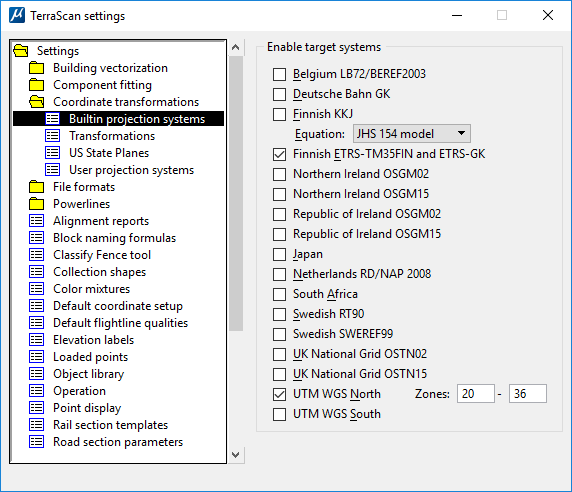
  
   
  
  * [define transformation](http://www.terrasolid.com/guides/tscan/introcoordinatetransformations.php?zoom_highlightsub=transformation)
     * projection change, `UTM 35 → GK 26, modify: xyz`
     
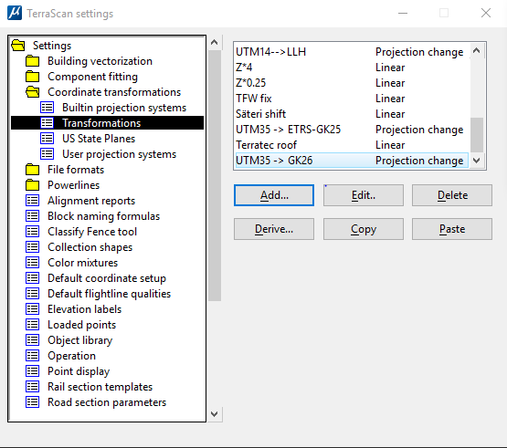

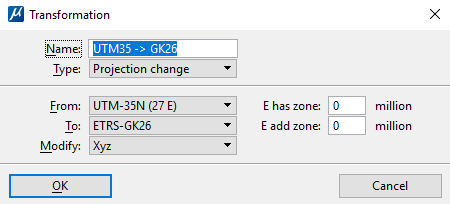

##### Read a subset of points

Your coordinate system being set, it is time to visualize and get familiar with your raw data.

 * In the main menu, go to [`File/Read points`](http://www.terrasolid.com/guides/tscan/mwreadpoints.php?zoom_highlightsub=read+points)

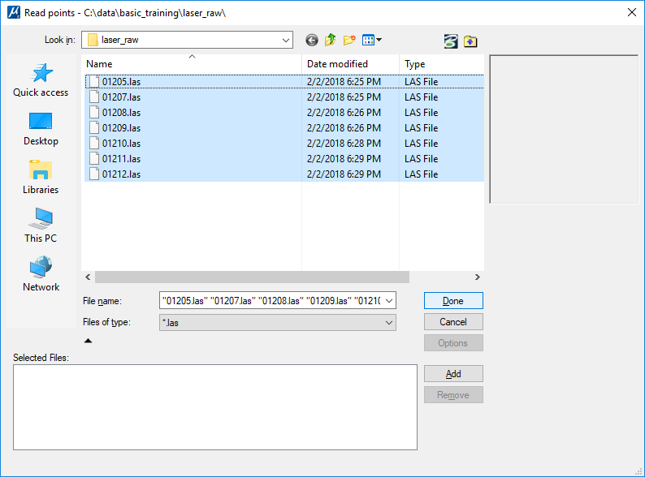

* Be sure to select the right transformation we defined earlier and the subset factor (here 1 out of 10 points is read)

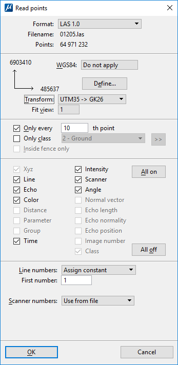

#### Trajectories

A lot of TerraScan and TerraMatch tools, specially during the matching process, need the flight trajectories.

##### Import Trajectories

* raw file formats, [format definition](http://www.terrasolid.com/guides/tscan/setfileformats_usertrajectoryformats.php) in settings
* [set directory (trajectory/)](http://www.terrasolid.com/guides/tscan/toolmanagetrajectories.php) 
   
   

   * import raw file (trajectory_raw/)
      * text file, format: time northing easting elevation roll pitch heading (TYXZRPH also implemented)
      * angle = degree (depends on raw trajectory file), adjust heading on if transformation from lat/lon to projection system, thinning normally on (`0.10 m/deg for airborne`)
      
      
      
##### Cut or split turnarounds of trajectories
   * For matching and tscan processing tasks
   
      * [Draw into design](http://www.terrasolid.com/guides/tscan/trjdrawintodesign.php) allows us to visualize the trajectories by creating lines in the active level
      
        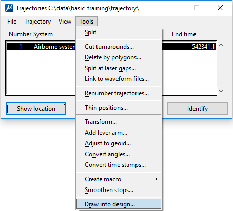         
             
        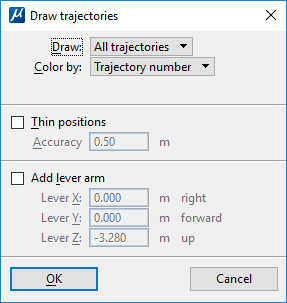
                                                                   
   * Several options to [split trajectories automatically or manually](http://www.terrasolid.com/guides/tscan/tool-pulldown-menu.php), here we will [use a polygon](http://www.terrasolid.com/guides/tscan/trjdeletebypolygons.php).
      
      1. Draw polygon around project area
      
      2. Select the polygon
      
     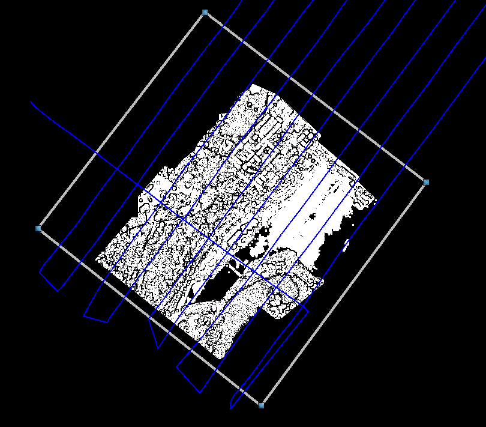
     
      3. Pick delete outside polygon
      
         
        
     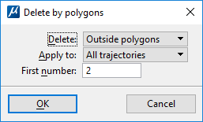

      
   * To check that the split when right and that the trajectories and points timestamps are coherent, we will deduce from which trajectory points come based on the timestamps. 
   
     1. For this, on the main bar, go to [`Line/Deduce using time`](http://www.terrasolid.com/guides/tscan/mwdeduceusingtime.php)

     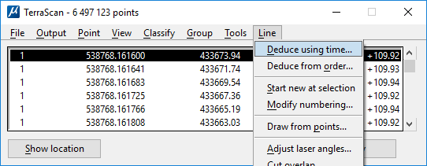  

     2. Then we will [display](http://www.terrasolid.com/guides/tscan/mwdisplaymode.php) the points based on their trajectories
     
   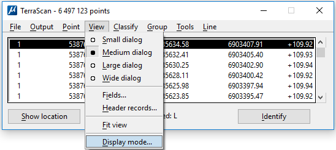  
    
    
   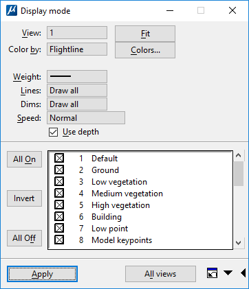
    
   
   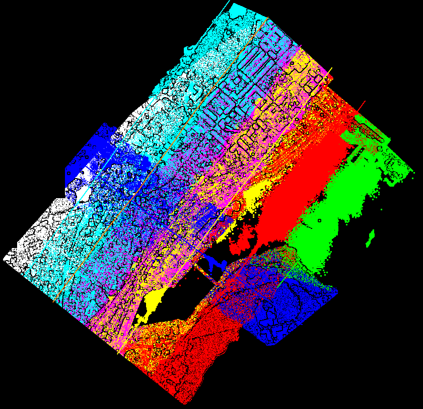     
    
 * At this stage, you can get familiar with the data through the [section](http://www.terrasolid.com/guides/tscan/tboxviewlaser.php) and display tools.
 
    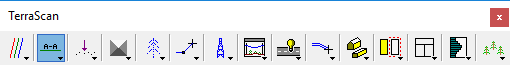   
    
 ---
 _Warning_ : 
 For the section tool, please follow the instruction on the bottom left of your screen.
 ---
 
 ---
 _Note_ :
 Our subset is ready and you checked that the trajectories are well related.
 ---
 
 #### Block Limit Definition
 
To work properly, we will divide our project area into different [blocks](http://www.terrasolid.com/guides/tscan/prjpmblock.php). It will allow to test in one block and then execute processes on every blocks independently. That way if an error arises on a specific block, it will not impact the others. The number of points in memory at a time will also be lower.

There are different ways to design blocks, here we will draw lines dividing our project area shape in three parts.

* To create these lines, active the level 9 and use microstation smart line tool

 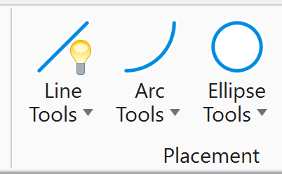
 
    

 * Once the lines created, we pick the [`Design Block Boundaries`](http://www.terrasolid.com/guides/tscan/tooldesignblockboundaries.php)
 
 
 
  * `Line level` contains user defined block division
  * blocks will be drawn to `Shape level`
  * number of points inside blocks will be drawn to `Label level`
  
 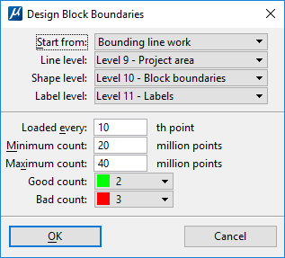  
 
 * If the selected levels are active, you should be able to see the result
  
  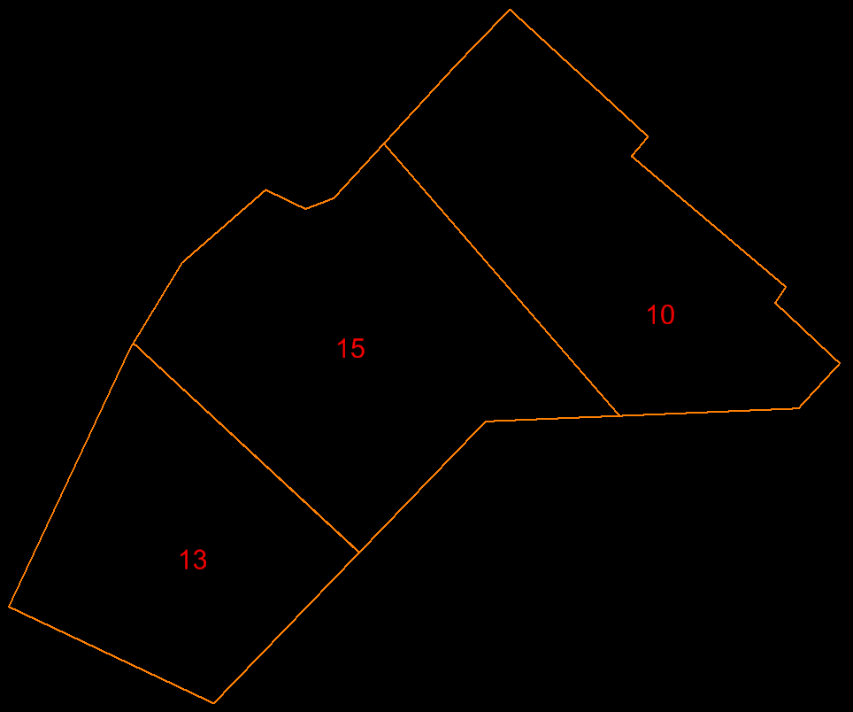  
  
  #### Point Class definition
  
In Terrascan, you can create and save [your own point class files](http://www.terrasolid.com/guides/tscan/tooldefineclasses.php). Here we will load an existing one:
`<trainingFolder>/classes.ptc`
 
  

 
 ---
 _Note_ : 
 We now have trajectories, points, blocks, and point classes checked. We will be able to formally define the project
 ---
 
### Project Formal Definition

The project related tools can be found in the [main tool box](http://www.terrasolid.com/guides/tscan/intromaintoolbox.php).

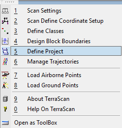  

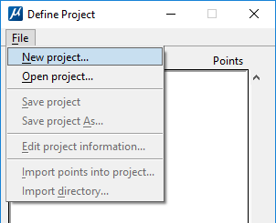

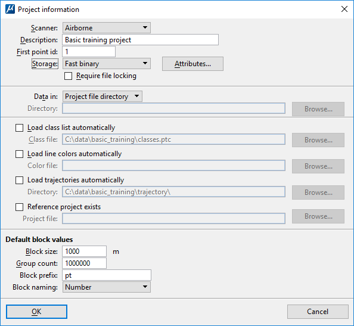

Here you have to select the attributes you want to be saved with your project. If you do not pick Color and then add color to your points, then the color will be lost after saving and closing the project.

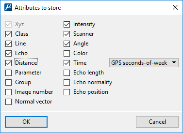
 
 ---
 _Warning_ : 
 The storage format is here really important. Only the `Fast Binary`, the default one, supports all the attributes!
 ---
 
 You can chose the location of different important project folders. For your first project, the closer to the default parameter would be the better.
 
 For the block size. We went through the block definition earlier so we will not use these default parameters, you can let them as they are.
 
 #### Saving the project
 
 As the project definition is done, we will save it. This has to be done after every big step.
 
 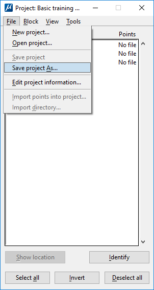

 ---
 _Note_ : 
 You can save the project anywhere but, as by default the data will be saved in the same folder, we prefer to use a folder name like Laser01, the number referring to your project step.
 ---
 

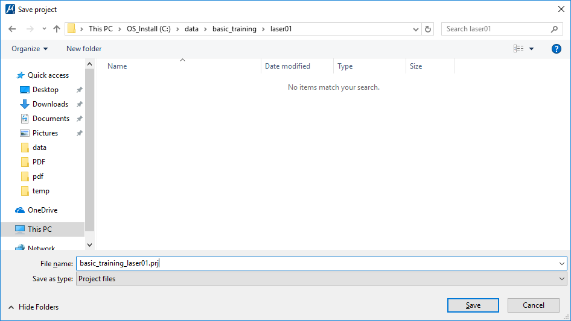
 
#### Creating the Blocks

The block boundaries have already be drawn, we just need to select them and to [declare them as the project blocks](http://www.terrasolid.com/guides/tscan/prjaddbyboundaries.php)

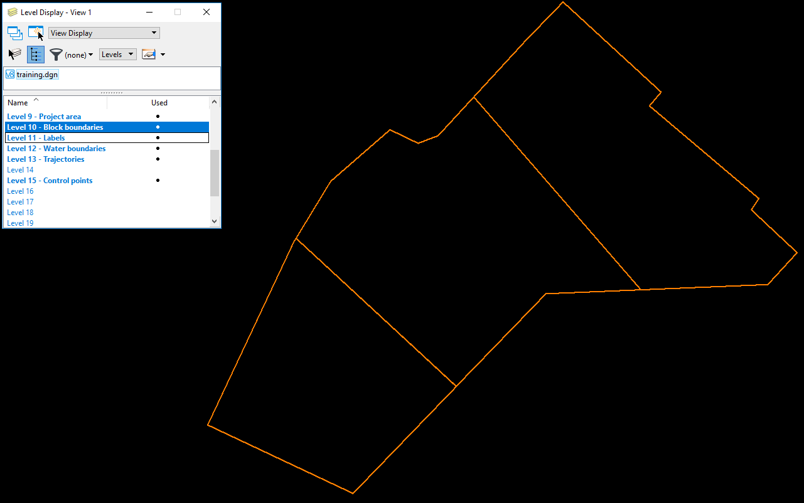

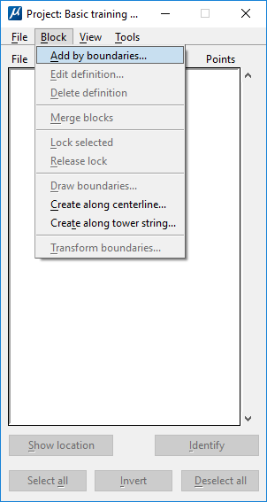

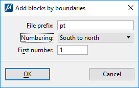

To check that it went well, use the project tool to draw them onto the dgn.

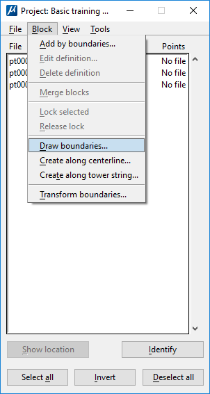

#### Points import

As you can see on the project window, no file is associated with the blocks. To do this you need to [import the point files into the project](http://www.terrasolid.com/guides/tscan/prjimportpointsintoproject.php). This will create fbi files in the project folder, maybe transforming the coordinate system if asked, and write the blocks metadata into the project file (*.prj).

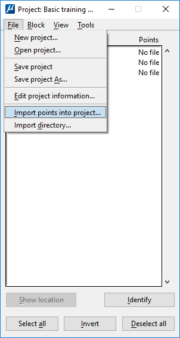

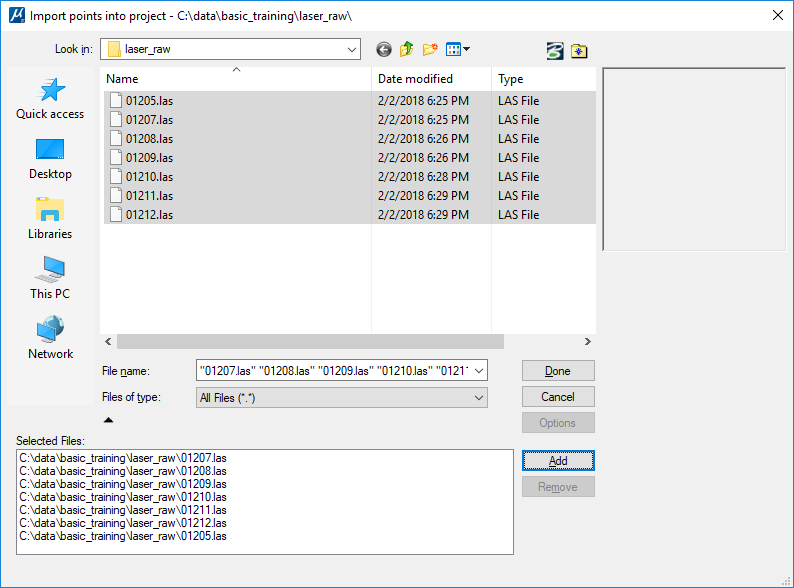

 ---
 _Trick_ : 
 You can import files stored in different folders with the "add" option
 ---

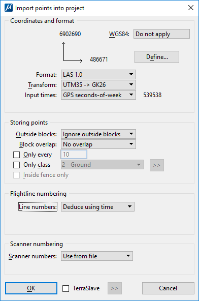

In this last window, we select the transformation as our point cloud is not in the same coordinate system as our vectors.
Please use the transformation we created earlier `UTM 35 → GK 26`

 ---
 _Note_ : 
 Using `Deduce using time` here save us one step by associating the points to their respective trajectories, it is based on timestamp
 ---

Your blocks are now ready!

## Boresight calibration of the scanner system using [TerraMatch](http://www.terrasolid.com/guides/tmatch/index.html)

### Data preparation : Classification

To help the matching tools, manual or automatic, we will here classify the data. By example, during the [tie lines search](http://www.terrasolid.com/guides/tmatch/search-tie-lines.php?zoom_highlightsub=tie+lines), it speeds up the calculation if you compare only the points of some classes.

#### Macro : automatic steps

The [macro files](http://www.terrasolid.com/guides/tscan/intromacroactions.php?zoom_highlightsub=macro) are text files defining a list of tasks with their parameters. The use of those macros helps a lot, specialy on big project because they can be applied on a set of blocks or on a set of blocks once they are validated. You can also distribute their execution between computers using [TerraSlave](http://www.terrasolid.com/guides/tscan/terraslavequickguide.php?zoom_highlightsub=terraslave). 

##### A look at the steps : 01_prepare_match.mac

Let's go through the steps in the macro prepared for this project. To do this, we use Tools/Macros... in the main menu. 

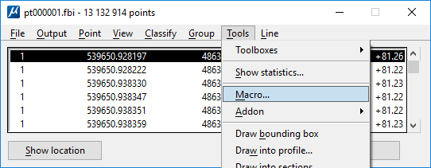

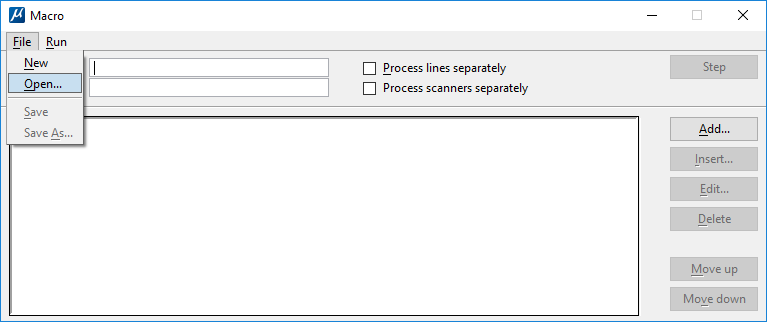

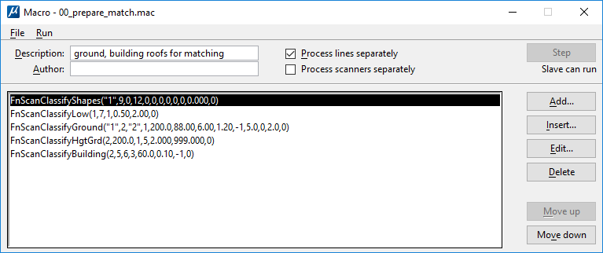

As you can see, our preprocessing consists in 5 steps. We will now explain them in details.

* Filter water points
The first steps consists in filtering the water points, we do that because they will not help to improve the matching and will slow the calculation.

We could use the intensity return or color on some dataset to do it but here, the water area have already be vectorized in our DGN (level 12). So we apply the classification tool : [By polygons](http://www.terrasolid.com/guides/tscan/crbypolygons.php?zoom_highlightsub=classify+by+polygons) with the macro step [Classify points](http://www.terrasolid.com/guides/tscan/maclassifypoints.php) and set their classification from 1 (Default) to 9 (Water).  

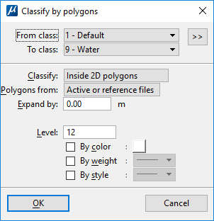

* Filter low points

There are always some errors in the points with isolated incoherent elevations. This time we will use the classify [Low points](http://www.terrasolid.com/guides/tscan/crlowpoints.php) tool to get rid of them. We sometimes also use the [Isolated points](http://www.terrasolid.com/guides/tscan/crisolatedpoints.php) tool. This step will limit the errors on the ground classification steps.

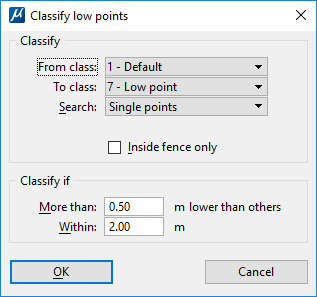

* Ground processing

For ALS with low density, the [ground classification](http://www.terrasolid.com/guides/tscan/crground.php) tool works really well. Ground definition is a really important aspect of Lidar processing, it is not only used to get end products like the one you can produce with TerraModeler, but also to classify other elements/objets and to do the matching. You should look through the user guide to properly understand how the tool works.

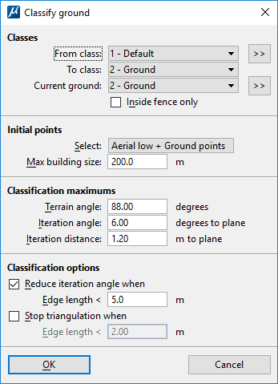

 ---
 _Note_ : 
 After the macro processing, you will have to go through the points and improve the ground manually if needed.
 ---

* Classify by height from ground : High vegetation 

All the matchimg corrections can not be easily found using only the ground. We will also need some aerial planar surfaces such as wall or building roofs. To get these aerial points, we will first put them in the high vegetation class. It will lower the amount of points during the planarity check algorithm. In general, always try to minimize the amount of points when using complex and ressource demanding features of TerraScan.

The tool used here is classify [Height from ground](http://www.terrasolid.com/guides/tscan/crbyheigthfromground.php).

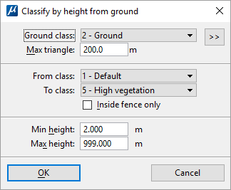

As you can see, here the points from default class(1) higher than 2 meters are put to the High Vegetation class(5)

* Classify building roofs

Now that all the high points are in the high vegetation class, we will classify specificly the roofs through a dedicated tool : [Classify buildings](http://www.terrasolid.com/guides/tscan/crbuildings.php). Beware of the name, other tools can help to classify the walls, this one is for the roofs (easier to get with ALS).

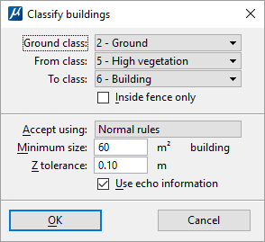

Its parameters are pretty straight forward.

##### Processing the macro

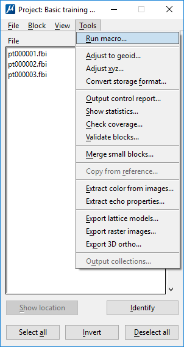

* Test run : Step by step

First we will do a test run on a **loaded block** step by step using the **Step** button. It will allow you to look at the point cloud evolution (using a display by Class and some sections) and see if a major problem happens. Once this test run is finished, you can [close the loaded points](http://www.terrasolid.com/guides/tscan/mwclosepoints.php) **without saving them**.

* Project run

This time we will run the macro on the whole project. Two points are importants :
 * First, **in the macro definition window**, check the `Process lines separately`. Indeed, we want to compare the ground and the roofs between the lines to get the correction values.
 
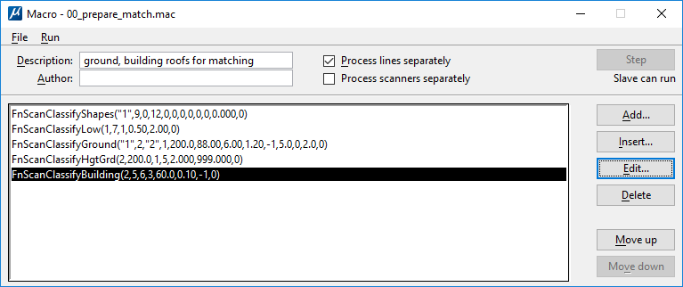
 
 * Second : **in the run macro window**, use points from neighboring blocks so that there won't be any differences in classification between blocks (block edge effects).
 
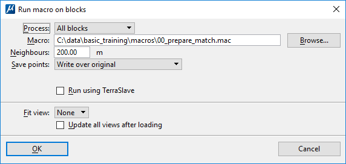

#### Lines Mismatch Visualization

To visualize the differences between the line, we will use the [Compute distance](http://www.terrasolid.com/guides/tscan/mwcomputedistance.php) tool, in the main window (Tools/Compute distance...).

 ---
 _Note_ : 
 Compute distance is a really important tool used in a lot of processes like [Grouping](http://www.terrasolid.com/guides/tscan/mwpmgroup.php)
 ---

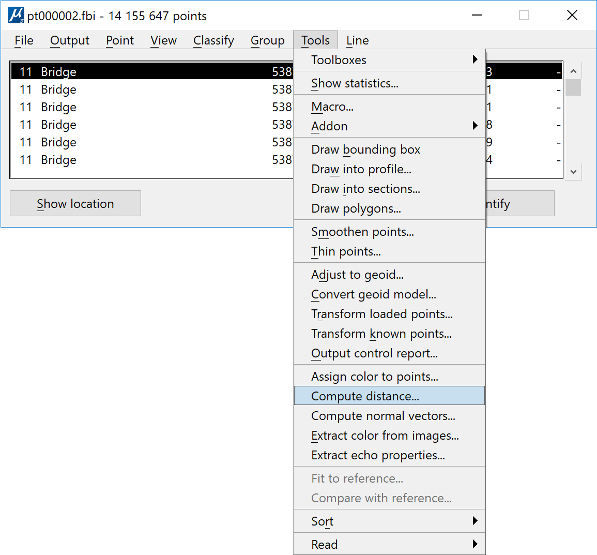

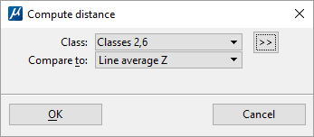

